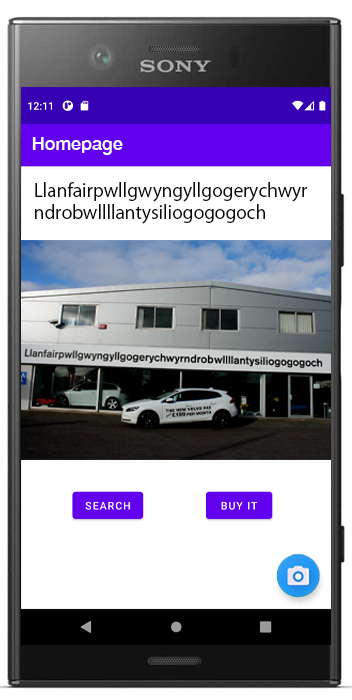
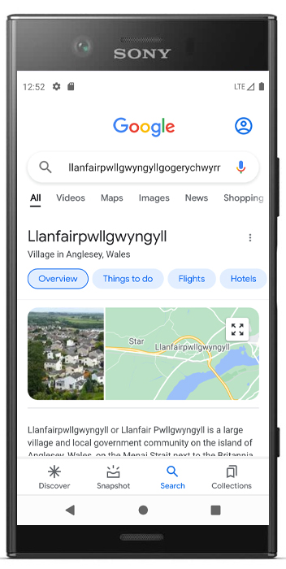

# *OCR hack*

### nwHacks 2022 submission

***What you see is what you search***

## What it does
- Not a fan of typing?
- Ever wondered how to pronounce [Llanfairpwllgwyngyll](https://www.youtube.com/watch?v=fHxO0UdpoxM)?
- Visually impared and need some help from machine learning?

Look no further!

The app harnesses the power of Google's machine learning and allows the user to snap a picture, copy and search the text from any visually recognizable elements within a few clicks.

  

### Try it out [**here**] (insert url after deployment)
### Checkout our [**Devpost submission**] (insert url after submission)

## Usage
Open project in Android Studio and run MainActivity under app > java > com.example.pictureapp

## How we built it
Android Studio, Java, Google Machine Learning kit, Github, Love.
